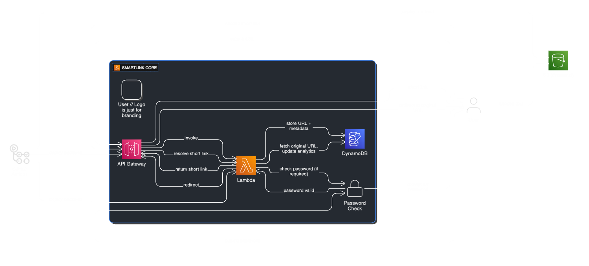

# SmartLink 🔗✨

A modern, serverless URL shortener with password-protected links, real-time analytics, and a polished React frontend.  Built for speed, security, and developer happiness.

<p align="center">
  
</p>

---

## 🚀 Live Demo

| Frontend | API Base |
|---------|----------|
| <https://your-frontend-domain.com> | <https://qzeybbuf4g.execute-api.us-east-1.amazonaws.com> |

Visit **/api** on the live site for interactive API documentation.

---

## ✨ Features

- **Shorten any URL** in milliseconds
- **Optional password protection** for private links 🔒
- **Click analytics** with DynamoDB counters 📊
- **Public REST API** (POST /shorten, GET /:code, GET /analytics/:code)
- **Serverless & pay-per-use** — AWS Lambda, API Gateway, DynamoDB, S3, CloudFront
- **Infrastructure-as-Code** with Terraform
- **Zero-secret CI/CD** via GitHub → AWS OIDC
- **Beautiful, responsive UI** powered by React, Vite, Tailwind & shadcn/ui

---

## 🏗️ Tech Stack

| Layer | Tech |
|-------|------|
| Frontend | React 18, TypeScript, Vite, Tailwind CSS, shadcn/ui |
| Backend | AWS Lambda (Python), API Gateway HTTP API, DynamoDB |
| Infra | Terraform, AWS IAM, S3, CloudFront |
| DevOps | GitHub Actions, Bun (package manager) |

---

## 💻 Local Development

```bash
# 1. Clone & install deps
git clone https://github.com/your-username/smartlink.git
cd smartlink/frontend/link-whisperer-smart
bun install  # or npm i

# 2. Start the dev server (Vite)
bun run dev  # http://localhost:5173

# 3. (Optional) Mock backend with LocalStack or SAM
```

---

## ☁️ Deploying to AWS

1. **Provision infrastructure**
   ```bash
   cd link-shortener/terraform
   terraform init
   terraform apply   # creates DynamoDB, Lambdas, API Gateway, S3, CloudFront
   ```
   Note the `api_endpoint` output — you’ll need it for the frontend.

2. **Configure CI secrets** (GitHub → Settings → Secrets):
   - `AWS_ROLE_ARN` — OIDC role SmartLink can assume
   - `AWS_REGION`   — e.g. `us-east-1`
   - *(optional)* `PROD_API_URL` — set `VITE_API_BASE` during builds

3. **Push to `main`** — the **CI/CD pipeline** will:
   - Install deps & build the React app
   - Sync `dist/` to the S3 bucket
   - Invalidate the CloudFront cache

That’s it!  Each commit redeploys in under a minute.

---

## 📑 API Quick Reference

```http
POST /shorten              # Create a short link
GET  /{code}               # Redirect
GET  /analytics/{code}     # Stats JSON
```

Full docs & examples at **/api**.

---

## 🤝 Contributing

Found a bug or have an idea?  Issues & PRs are welcome!  Run the linter/tests before pushing:

```bash
bun run build        # type-check & test build
```

---

## 📝 License

2025 Ram Kinkar 
